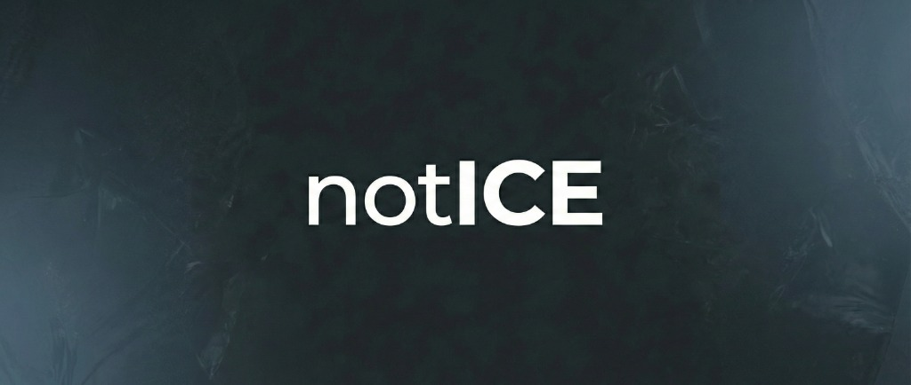

# notICE 🧊



**A localized, decentralized safety alert system.**

notICE allows a city or region to self-host a single server that citizens can connect to via a mobile app to report and view dangerous situations — **anonymously**.

## 🚀 One-Click Deploy

Deploy your own notICE server in 60 seconds:

[](https://railway.app/template/notICE?referralCode=notICE)

After deploying, set these environment variables in Railway:
- `REGION_NAME` — Your city name (e.g., "Idaho Falls, ID")
- `REGION_LAT` / `REGION_LONG` — Map center coordinates
- `TELEGRAM_BOT_TOKEN` / `TELEGRAM_CHAT_ID` — For push notifications (optional)

---

## Philosophy

- **Zero Big Tech**: No Firebase, No Google Maps API, No AWS
- **Simplicity**: The backend is a single deployable binary
- **Privacy**: No user tracking, anonymous authentication only
- **Local-First**: Cities own their data, not corporations

## Tech Stack

| Layer | Technology | Why |
|-------|------------|-----|
| **Backend** | [PocketBase](https://pocketbase.io/) | Single Go binary with SQLite, Auth, Realtime |
| **Frontend** | Flutter | Cross-platform mobile (iOS/Android) |
| **Maps** | [flutter_map](https://pub.dev/packages/flutter_map) + OpenStreetMap | No Google dependency |
| **Notifications** | Telegram Bot API | Bypasses APNS/FCM complexity |

## How It Works

### Geohashing Strategy

1. When a user reports an incident, the app calculates a **Geohash (precision 6)** from their coordinates
2. The report is saved to the database with the geohash
3. Users subscribe to the geohash of their **current location + neighbors** for realtime updates
4. New reports in subscribed regions appear instantly on the map

### Data Flow

```
┌─────────────────┐     ┌─────────────────┐     ┌─────────────────┐
│   Flutter App   │────▶│   PocketBase    │────▶│  Telegram Bot   │
│  (Reporter)     │     │  (Single Binary)│     │  (Alerts)       │
└─────────────────┘     └─────────────────┘     └─────────────────┘
        ▲                       │
        │                       │ Realtime
        │                       ▼
┌─────────────────┐     ┌─────────────────┐
│   Flutter App   │◀────│   Geohash       │
│  (Subscribers)  │     │   Pub/Sub       │
└─────────────────┘     └─────────────────┘
```

## Project Structure

```
notICE/
├── backend/
│   ├── pb_hooks/           # PocketBase JavaScript hooks
│   │   └── telegram.pb.js  # Telegram notification trigger
│   └── pb_schema.json      # Database schema export
├── app/                    # Flutter mobile application
│   └── ...
├── docs/                   # Deployment guides
├── LICENSE
└── README.md
```

## Quick Start (3 Steps)

### 1. Get the code

```bash
git clone https://github.com/adriancmurray/notICE
cd notICE
```

### 2. Run the setup wizard

```bash
./setup.sh
```

This will ask for:
- Your city/region name
- Map coordinates (get from Google Maps)
- Telegram bot token (optional, for push notifications)

### 3. Done! 

Your server is running at `http://localhost:8090`

**First time setup:** Open `http://localhost:8090/_/` to create an admin account.

---

## Manual Docker Setup

If you prefer to configure manually:

```bash
# Copy and edit the config
cp .env.example .env
nano .env  # Add your settings

# Start the server
docker compose up -d
```


## Configuration

### Environment Variables

| Variable | Description | Example |
|----------|-------------|---------|
| `POCKETBASE_URL` | Your server URL | `https://notice.yourcity.gov` |
| `TELEGRAM_BOT_TOKEN` | Bot token from @BotFather | `123456:ABC-DEF...` |
| `TELEGRAM_CHAT_ID` | Channel/Group ID for alerts | `-1001234567890` |

## Self-Hosting Guide

See [docs/DEPLOYMENT.md](docs/DEPLOYMENT.md) for complete instructions on:

- Setting up a VPS (DigitalOcean, Hetzner, etc.)
- Configuring SSL with Let's Encrypt
- Running PocketBase as a systemd service
- Creating a Telegram bot for your region

## Contributing

Contributions welcome! Please read [CONTRIBUTING.md](CONTRIBUTING.md) first.

## License

MIT License — See [LICENSE](LICENSE) for details.

---

*Built for communities, not corporations.*
